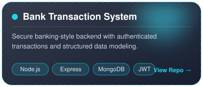
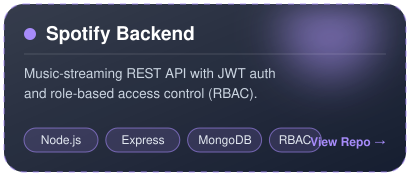
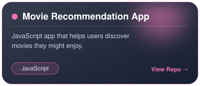
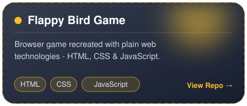
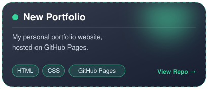
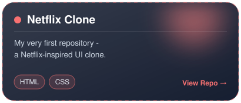

        

  

   

   

js
const aman = {
  name: "Aman Umrao",
  role: "B.Tech CSE Student",
  college: "ABES Engineering College, Ghaziabad",
  location: "Ghaziabad, India 🇮🇳",
  focus: ["Full Stack Development", "AI/ML", "DSA", "Cloud & DevOps"],
  currentlyLearning: ["Next.js", "TypeScript", "Docker", "AWS", "System Design"],
  problemsSolved: "900+",
  openTo: ["SDE", "Backend", "Full Stack", "AI/ML Internships"],
  funFact: "I enjoy turning complex problems into clean, scalable solutions ⚡"
};
🔭 Building scalable Full-Stack & AI-powered applications
💻 Hands-on with the MERN Stack, FastAPI & REST APIs
🧠 Strong foundation in Data Structures & Algorithms
🌱 Currently levelling up in Next.js, TypeScript, Docker, AWS & System Design
👯 Looking to collaborate on Open Source, Full-Stack & AI projects
  

 

💻 Languages  

⚛️ Frontend  

🖥️ Backend & Databases  

🧰 Tools & Cloud  

DSA • OOP • DBMS • OS • Computer Networks • REST APIs • JWT Auth • RBAC • MVC Architecture

   

 
 <table> <tr> <td></td> <td></td> </tr> <tr> <td></td> <td></td> </tr> <tr> <td></td> <td></td> </tr> </table> 
   

 
           

  

   

   

 
     
   

 

Always up for a good technical conversation, a collaboration, or an internship opportunity. 🚀

 

